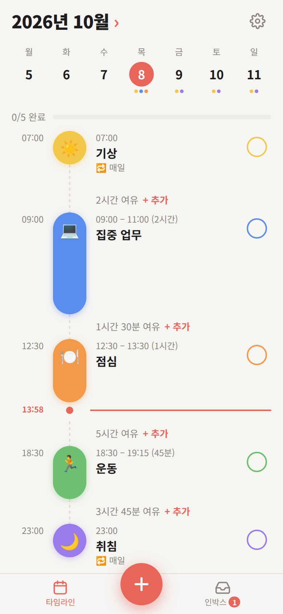
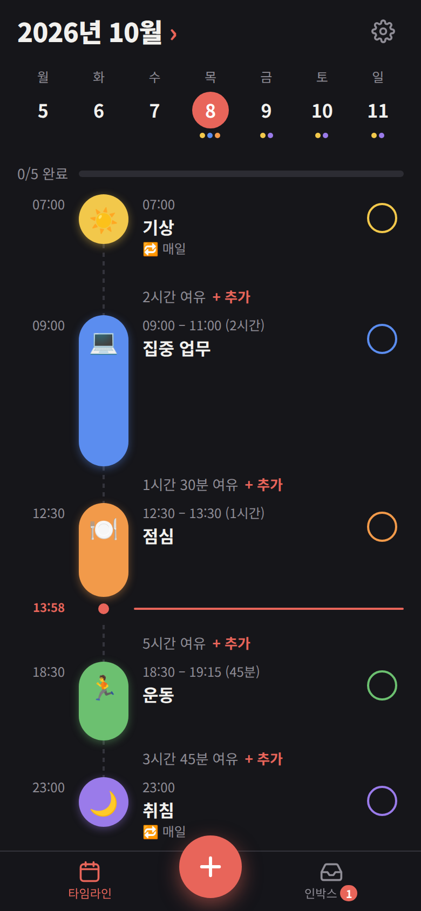

# 하루 플래너

광고 없는 타임라인 데일리 플래너 (PWA)

**바로 열기 → https://sohee-zoe.github.io/daily-planner/**

<p>
  
  
</p>

## 기능

- **타임라인** — 하루 일정을 시간순으로 표시, 일정 사이 빈 시간과 현재 시각 선
- **인박스** — 시간을 아직 정하지 않은 할 일 모아 두기
- **반복** — 매일 / 평일 / 매주 / 요일 선택 / 매월, 반복 일정의 하루만 삭제 가능
- **하위 작업·메모** — 일정마다 체크리스트와 메모
- **아이콘·색상** — 기본 목록 + 원하는 이모지와 색을 직접 추가
- **다크 모드**, **오프라인 사용**, 앱처럼 **홈 화면 설치**

## 설치

- **iPhone**: Safari로 열기 → 공유 → "홈 화면에 추가"
- **Android**: Chrome으로 열기 → ⋮ 메뉴 → "앱 설치"

## 데이터

- 모든 데이터는 **이 기기의 브라우저(localStorage)에만** 저장됩니다.
- 서버, 계정, 광고, 추적 없음.
- 기기를 바꾸거나 백업하려면 설정 → 내보내기 / 가져오기 (JSON).
- 브라우저 데이터를 지우면 일정도 지워지니 가끔 내보내기를 해 두세요.

## 개발

빌드 도구 없이 HTML·CSS·JS 파일 그대로 동작합니다.

```sh
python3 -m http.server 8000
# http://localhost:8000 열기
```

| 파일 | 역할 |
|---|---|
| `index.html` | 화면 구조 |
| `app.js` | 상태, 렌더링, 편집기 |
| `styles.css` | 스타일 (라이트/다크) |
| `sw.js` | 오프라인 캐시 |
| `manifest.webmanifest` | 설치 정보, 아이콘 |

### 배포

`main` 브랜치에 push하면 GitHub Pages가 1~2분 안에 반영합니다.

앱 파일을 바꿨다면 **`sw.js`의 `VERSION`을 올려야** 이미 설치된 앱도 새 버전을 받습니다.
